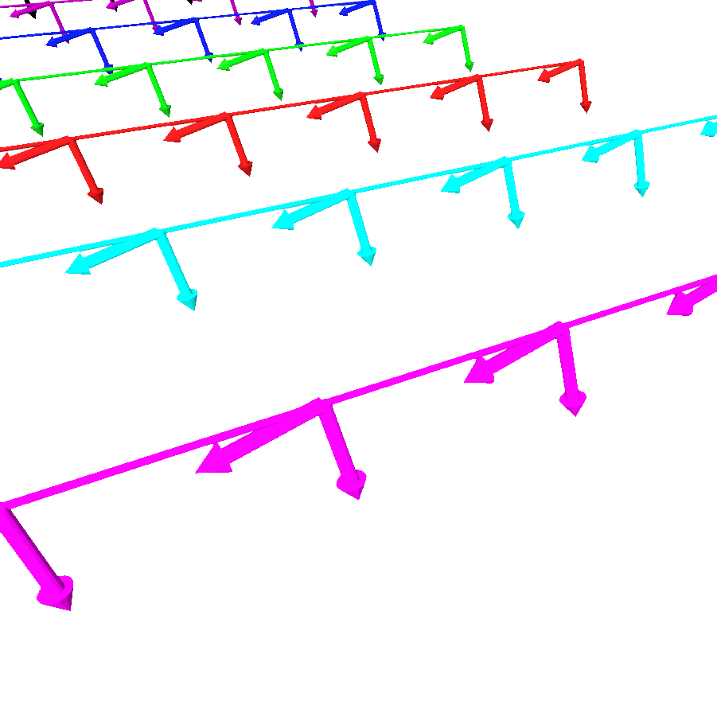

 
applyLeanAngle function
=============================

To grind an object, the grinding tool must approach it with a certain angle of attack, otherwise
the grinder will be laid flat on the surface of the object. In order to do that, an angle of attack is applied
on each pose of the robot grinding trajectory. This angle of attack is defined by the parameter `lean_angle_` of the
`Bezier` library. We also precise on which axis we want to apply the lean angle through the attribute `axis_of_rotation_` 
(X, Y or Z).

The following animation show the effect of the lean angle on the robot poses :

