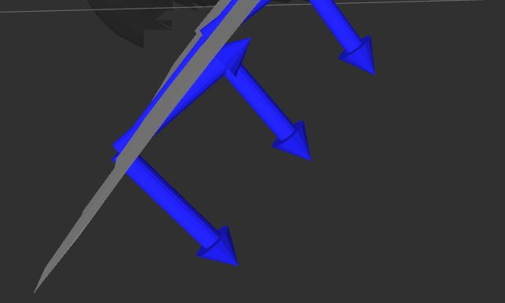
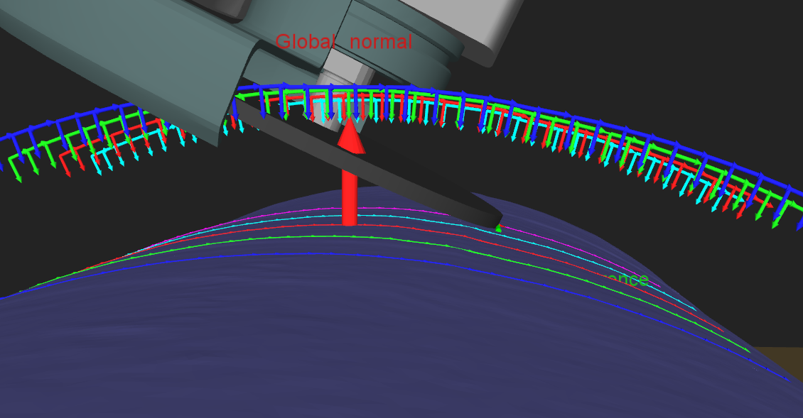
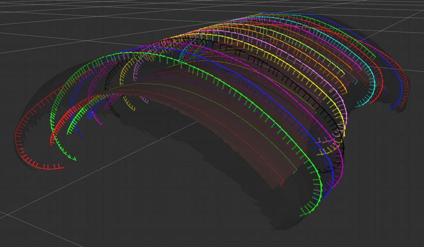
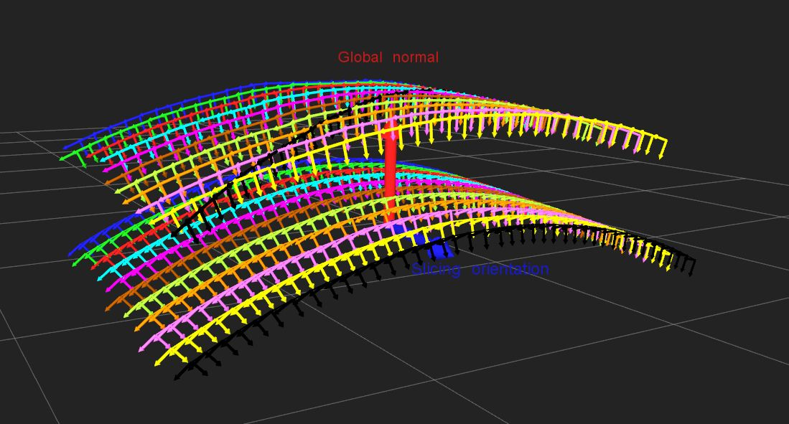
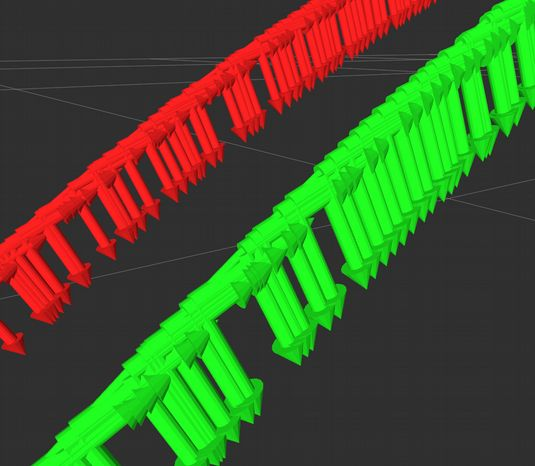
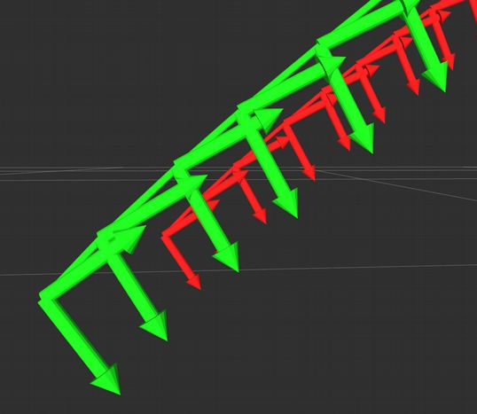
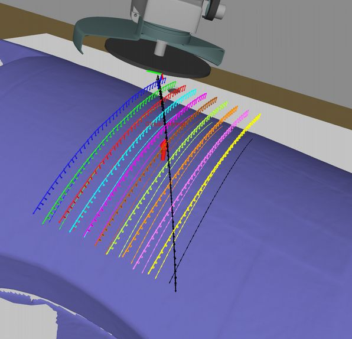

  Bezier library documentation
=============================

BezierGrindingSurfacing class in bezier_grinding_surfacing.cpp
==============================================================

`BezierGrindingSurfacing` is a class which inherits from `Bezier` class in `bezier_grinding_surfacing.cpp`.
This class, with support of methods from `Bezier` class, generate trajectories on a mesh in surfacing mode.
The surfacing mode is a mode where there is not defect mesh considerated. In fact, the trajectory will be only generated on the surface of input mesh.

Principle: Generation of trajectories
=====================================

1. Estimation of global normal
------------------------------
Use function [estimateGlobalNormal](README_bezier_library.md). This function returns the global normal from an input mesh.

2. Estimation of slicing direction
----------------------------------
Use function [estimateSlicingDirection](README_bezier_library.md). This function returns a slicing direction that will be use to cut mesh.

3. Dilation
-----------
Use function [dilation](README_bezier_library.md). This function will return a second mesh, which is the dilation of the first one.

4. Keep upper part of dilated mesh
----------------------------------
Use function [keepUpperPartOfDilatedMesh](README_bezier_library.md).

5. Estimate grinding slicing planes
-----------------------------------
Use function [estimateGrindingSlicingPlanes](README_estimate_grinding_slicing_planes.md). This function computes the number of lines needed computed with parameters inputs and returns all planes equations which are necessary to cut mesh.

6. Slice mesh with planes
-------------------------
Use function [sliceMeshWithPlanes](README_bezier_library.md). This function, with all equations plan, will cut mesh at each intersection between plans and mesh.

7. Generation robot poses along lines
-------------------------------------
Use function [generateRobotPosesAlongStripper](README_generate_robot_poses_along_stripper.md). This function will create for each line a point with his normals X, Y and Z, which will represent robot poses for each line.

8. Harmonize line orientation
-----------------------------
Use function [harmonizeLineOrientation](README_harmonize_line_orientation.md). This function will harmonize lines orientation, it means that the beginning point of each line will be on the same side that the others.

IMAGE BEFORE AFTER

9. Provide lean angle
---------------------
Use function [applyLeanAngle](README_apply_lean_angle.md). This function will provide an angle for the tool. For each pose, it will apply an angle in orientation matrix.

10. Generation of extrications
----------------------------------------
Use function [estimateExtricationGrindingPlanes](README_estimate_extrication_grinding_planes.md). This function compute the all planes equations and return them. In order to find an equation for a plane n, a plan is computed between last point of grinding line n and first point of next grinding line n+1.

By the same way than grinding lines, 3 functions will be called after:
6. Slicing mesh with planes with function [sliceMeshWithPlanes](README_bezier_library.md), which is apply on dilated mesh.
7. Generation of robot poses along lines with function [generateRobotPosesAlongStripper](README_generate_robot_poses_along_stripper.md), which will create robot poses on lines previously created.
8. Harmonization of lines orientation with function [harmonizeLineOrientation](README_harmonize_line_orientation.md), which will same the beginning of each line on the same side of mesh.

11. Invert X axis of line poses
-------------------------------
Use function [InvertXAxisOfLinePoses](README_invert_x_axis_of_line_poses.md)
This function returns for each point on each line a vector X and a vector Y which have an orientation reverted.

12. Estimate last extrication slicing plane
-------------------------------------------
With the same behavior than [estimateExtricationGrindingPlanes](README_estimate_extrication_grinding_planes.md).
The plan equation returned is the plan defined by the plan between the last point of last grinding line and the first point of first grinding line.

By the same way than extrication lines, 3 functions will be called after:
6. Slicing mesh with planes with function [sliceMeshWithPlanes](README_bezier_library.md), which is apply on dilated mesh.
7. Generation of robot poses along lines with function [generateRobotPosesAlongStripper](README_generate_robot_poses_along_stripper.md), which will create robot poses on lines previously created.
8. Harmonization of lines orientation with function [harmonizeLineOrientation](README_harmonize_line_orientation.md), which will same the beginning of each line on the same side of mesh.

13. Filtering of extrications trajectories
------------------------------------------
Use function [filterExtricationTrajectory](README_filter_extrication_trajectory.md). This function will delete parts of extrication lines, where points for robot poses have an orientation too complicated.

 | 
----------------------------- | ---------------------------
Before filtering extrications | Extrication filter result

14. Filtering of neighbor points of trajectories which are too closed
---------------------------------------------------------------------
Use function [filterNeighborTooClose](README_filter_neighbor_too_close.md). This function return, from a given number of poses along lines, a new number of poses which is smooth.

 | 
----------------------------- | ---------------------------
Before filtering neighbor points | Neighbor points filter result

15. Result
----------
After all these steps, here is the result given on a little part of an input mesh:

Other Functions provided by BezierGrindingSurfacing
===================================================

In `BezierGrindingSurfacing`, other methods are implemented:

setMeshesPublisher
------------------
Declared meshes publishers in order to display them in RViz.
See [here](README_other_functions.md) for more details.

setSlicingOrientation
---------------------
Set slicing orientation of mesh, with the information returned by `estimateSlicingOrientation` function.
See [here](README_other_functions.md) for more details.

validateParameters
------------------
This function checks if input parameters (tool width, covering percentage) are correct.

