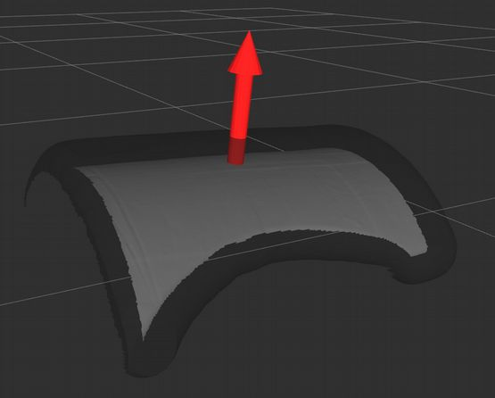
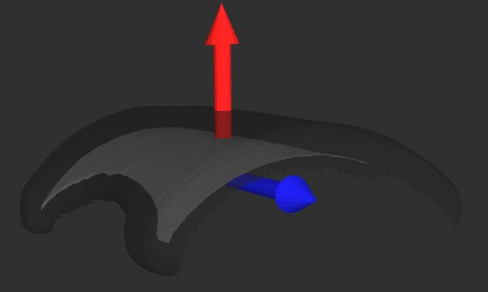
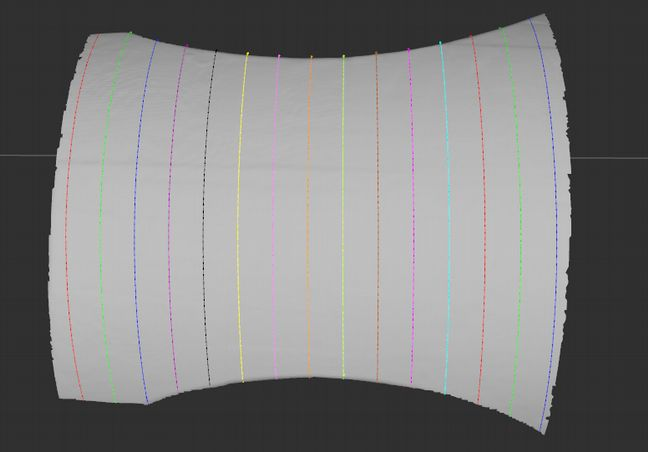
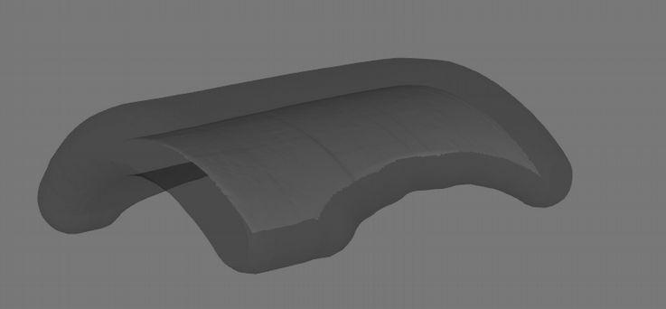
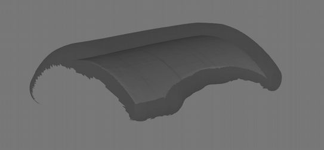

  Bezier library documentation
=============================

Bezier class in bezier_library.cpp
==================================

`Bezier` is an abstract class which contains functions used for path planning in `bezier_library.cpp`. Other classes can inherits from this class, like class `BezierGrindingSurfacing` in `bezier_grinding_surfacing.cpp`, documented [here](README_bezier_grinding_surfacing.md).

`Bezier`'s class contains the following functionnalities:

appendInputMesh
---------------
This function is implemented with `VTK` library.
Load a mesh from directory path.

saveMesh
--------
This function is implemented with `VTK` library.
Save a mesh in a directory path.

displayMesh
-----------
Display a mesh (by publisher) in `RViz`.

displayTrajectory
-----------------
This function is implemented with `rviz_visual_tools`.
Display trajectory generated in RViz.

computeNormals
--------------
This function is implemented with `VTK` library.
From an input mesh, it will compute normals for each cells in mesh in case of there is no normals.

estimateGlobalMeshNormal
------------------------
This function is implemented with `PCL` library.
From an input mesh, it will compute global normal of the mesh.
The result is displayed with `rviz_visual_tools`.

estimateSlicingOrientation
--------------------------
This function is implemented with `PCL` library.
From an input mesh, it will compute the slicing direction (rectilinear trajectory), from result of `estimateGlobalMeshNormal`.
The result is displayed with `rviz_visual_tools`.

sliceMeshWithPlane
------------------
This function is implemented with `VTK` library.
This function takes plan coordonates and create a VTK plane which will cut mesh with this one.

sliceMeshWithPlanes
-------------------
This function is implemented with `VTK` library.
With the same behavior than `sliceMeshWithPlane`, this function will take a plan coordinate vector and will cut mesh with all these plans.

dilate
------
This function is implemented with `VTK` library.
To generate different passes and/or extrication passes, the input mesh needs to be enlarged.
The principle of dilation in 3 dimensions is that a sphere of a given diameter rolls all around a surface (here, our mesh).

                   | 
------------------------------------------- | ------------------------------
Dilation principle                          | Example of dilated mesh

We need to use this process when we want to create extrication passes, in order to be sure that the trajectories will be outside of input mesh.
This process is used too when the defect is too big. In this case we dilate the mesh step by step until the defect is fully covered.

keepUpperPartOfDilatedMesh
--------------------------
This function is implemented with `VTK` library.
In order to generate "accessible" trajectories, only upper part of dilated mesh is kept.
By this way, when extrication passes are generated on this mesh, they are only generated on a accessible part of this one, to avoid potentials collisions.

