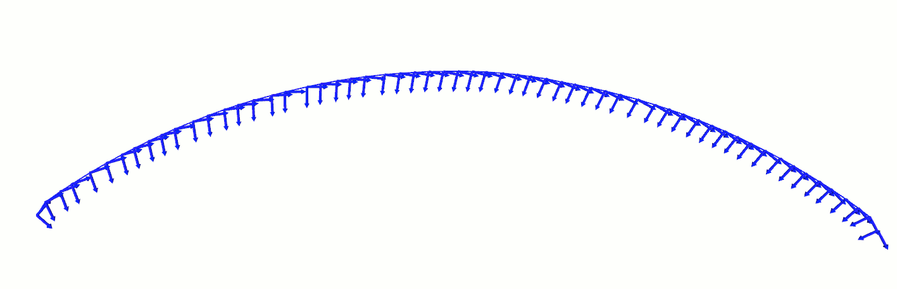

 
filterNeighborPosesTooClose function
=============================

This function is a filter allowing to soften a trajectory. It will reduce the amounts of points by 
removing points which are too closes of their neighbors. To acheive that, the for each valid point of the trajectory,
we compute the distance between the considered point and his next neighbor. If the distance is less than the minimal distance 
given as parameter, the neighbor is removed. This operation is repeated until a point far enough is found. This point will then 
become the next valid point, and then the operation is repeated until the end of the trajectory is reached.

