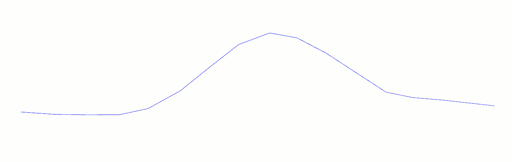

 
generateRobotPosesAlongStripper function
=============================

This function allow to genrate a batch of robot poses along a line represented by a `vtkStripper`.
The poses are generated using the following pattern : 
- The normal Z is obtained using the normal of the mesh at the considered point
- The normal X is the vector between the current point and his next neighbor
- The normal Y is computed by cross product between X and Z

The following animation illustrate the generation of the poses with the [lean angle](README_apply_lean_angle.md)
being applied :

